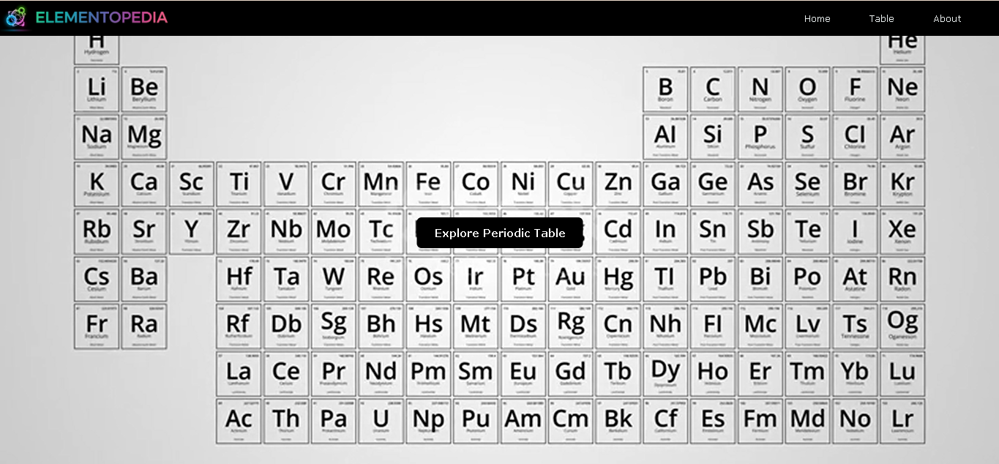
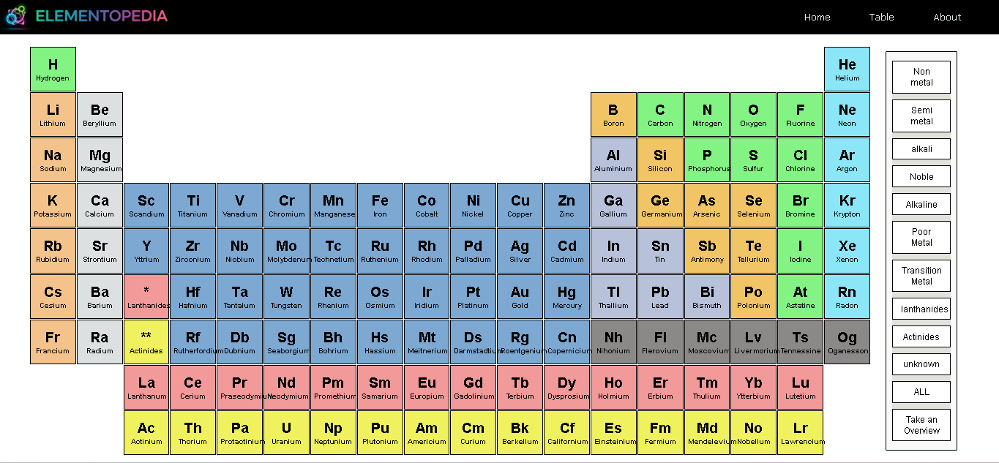
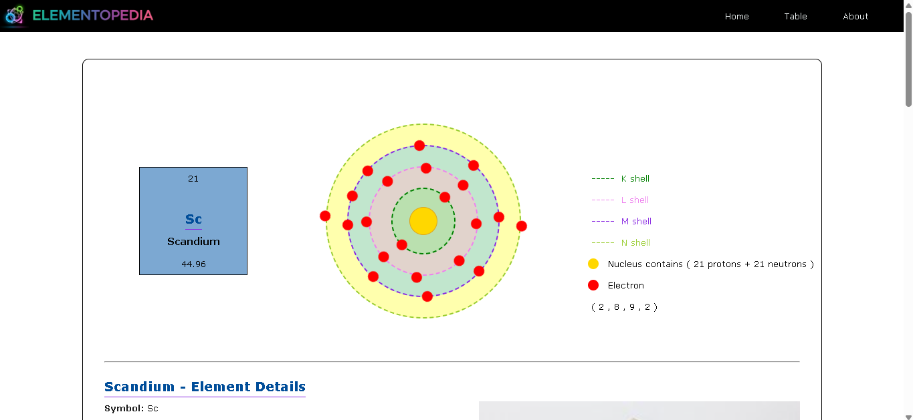
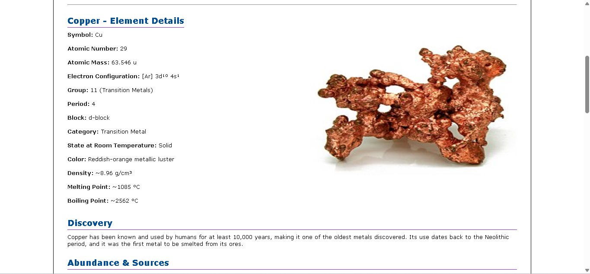
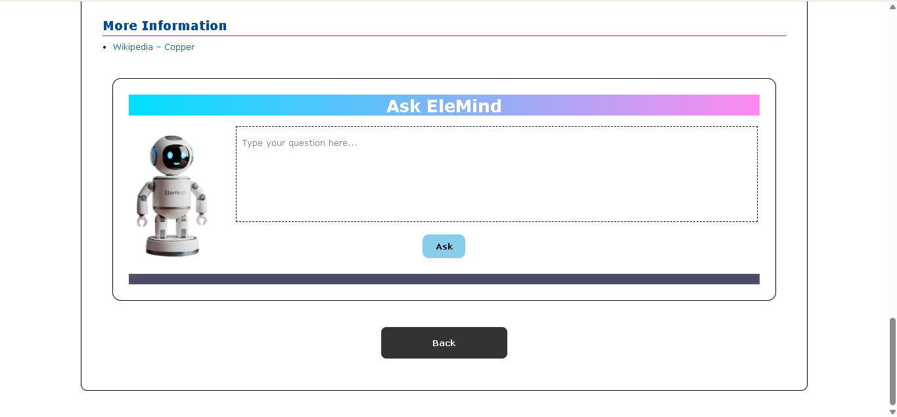
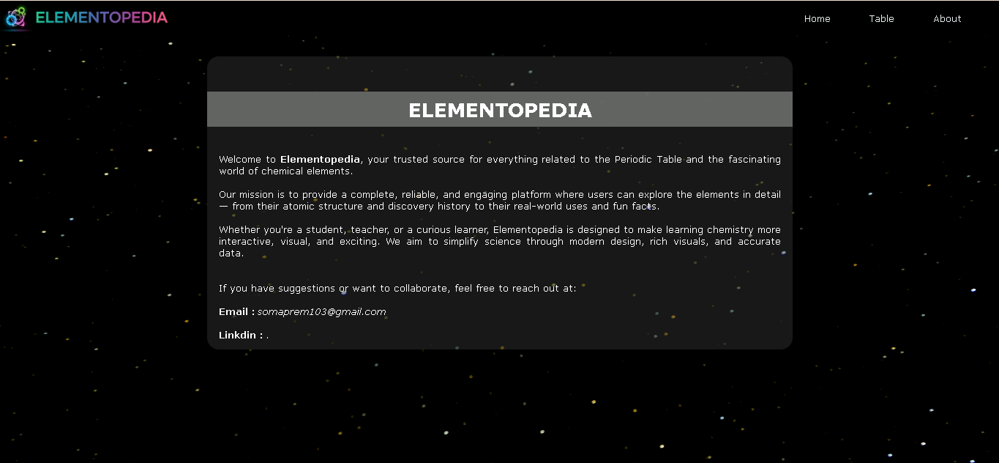

Elementopedia 
Elementopedia is an interactive web project that provides complete information about all chemical elements with videos, images, animations, Wikipedia data, and an AI assistant for learning chemistry.

🚀 Features

Detailed element info (properties, structure, uses)
Videos, images & atomic animations
Wikipedia integration
Interactive periodic table
Element comparison tool
AI assistant "Elemind"

🛠️ Tech Stack

HTML, CSS, JavaScript
,PHP (XAMPP)
,MySQL
,AI API integration

